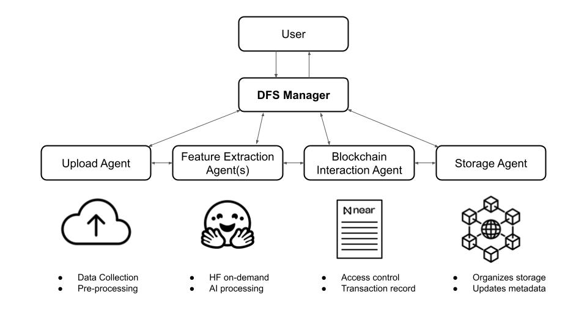

# Decentralized File Storage Manager - Team of AI Agents

The Decentralized File Storage Manager (DFS Manager) is a team of AI Agents, built with NEAR AI and integrated with NEAR smart contracts, in charge for handling decentralized file storage on IPFS. It is a standalone solution made for any app builder willing to move from central databases to decentralized storage networks. The DFS manager automates the file processing: from the file collection through a drag-and-drop window, the file is passed through a funnel of dedicated agents specialized in file analysis, tagging, indexing, including metadata extraction with AI, until a final file storage optimized for fast retrieval. 

