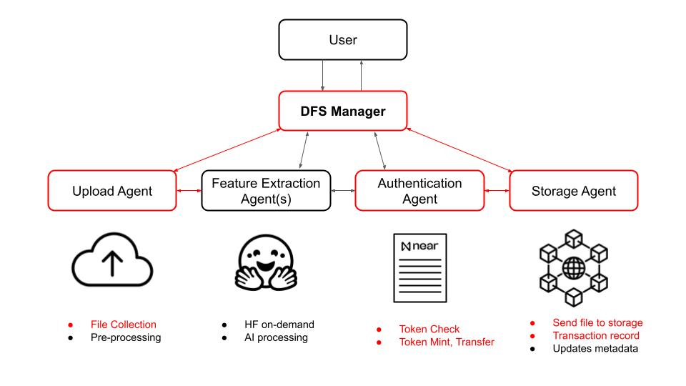

# Decentralized File Storage Manager - Team of AI Agents

The Decentralized File Storage Manager (DFS Manager) is a team of AI Agents, built with NEAR AI and integrated with NEAR smart contracts, in charge for handling decentralized file storage on IPFS. It is a standalone solution made for any app builder willing to move from central databases to decentralized storage networks. The DFS manager automates the file processing: from the file collection through a drag-and-drop window, the file is passed through a funnel of dedicated agents specialized in file analysis, tagging, indexing, including metadata extraction with AI, until a final file storage optimized for fast retrieval. 

> **Why Decentralized Storage ?** Centralized storage struggles with single points of failure and scalability, while content-addressed, peer-to-peer file systems enhanced by blockchain offer security and access control. Using a team of AI agents to handle the technicity of Decentralized Storage Networks makes it easy and accessible to everyone.



### Architecture
Inspired by [A Secure File Sharing System Based on IPFS and Blockchain](https://www.researchgate.net/publication/360383364_A_Secure_File_Sharing_System_Based_on_IPFS_and_Blockchain) (2022), the DFS Manager adopts a group-based model, where NEAR Protocol smart contracts are used for access control and transaction recording, while various Hugging Face-hosted AI models are called on-demand to process file analysis and metadata extraction.

**Organizational chart and data flow**
```
+-----------------------------------------------------+
| Owner (NEAR Account: e.g., theosis.1000fans.xyz)    |
| - Deploys Smart Contract                            |
| - Uploads content via Manager Agent                |
| - Manages group membership                         |
+-----------------------------------------------------+
          | (1) Deploys contract, registers group
          | (2) Initiates file upload via chat
          v
+-----------------------------------------------------+
| Smart Contract (DFS_manager)                        |
| - Stores: group_keys, group_members, transactions   |
| - Enforces: token-based access control             |
| - Methods: register_group, record_transaction,     |
|            add/remove_group_member, get_group_key  |
+-----------------------------------------------------+
          | (3) Records metadata (trans_id, IPFS CID)
          | (4) Verifies token ownership for key access
          v
+-----------------------------------------------------+
| NEAR Blockchain                                     |
| - Logs: contract state changes (via logs)          |
| - Tracks: token ownership (via 1000fans contract)  |
| - Ensures: integrity of transactions              |
+-----------------------------------------------------+
          | (5) Provides token ownership data
          | (6) Stores contract state
          v
+-----------------------------------------------------+
| Users (Token Holders: e.g., fan1.testnet)           |
| - Owns: 1000fans tokens                            |
| - Requests: group keys and file access via chat    |
+-----------------------------------------------------+
          | (7) Chats with Manager Agent
          v
+-----------------------------------------------------+
| AI Agents (Team coordinated by Manager Agent)       |
| +-------------------+                              |
| | Manager Agent     |                              |
| | - Chats with users| (8) Routes tasks            |
| | - Routes tasks    |------------------>           |
| +-------------------+                              |
|         | (9) Delegates upload                    |
|         v                                          |
| +-------------------+                              |
| | Upload Agent      |                              |
| | - Receives files  | (10) Delegates extraction   |
| | - Delegates tasks |------------------>           |
| +-------------------+                              |
|         | (11) Extracts features                  |
|         v                                          |
| +-------------------+                              |
| | Feature Extraction Agents                        |
| | - Tempo Detection |                              |
| | - Genre Detection | (12) Returns metadata       |
| | - etc.            |<-------------------          |
| +-------------------+                              |
|         | (13) Passes encrypted files & metadata   |
|         v                                          |
| +-------------------+                              |
| | Storage Agent     |                              |
| | - Encrypts files  | (14) Pins to IPFS            |
| | - Pins to IPFS    |------------------>           |
| | - Updates metadata|------------------>           |
| +-------------------+                              |
|         | (15) Updates blockchain                 |
|         v                                          |
| +-------------------+                              |
| | Blockchain Tracking Agent                        |
| | - Calls Smart Contract                           |
| | - Records transactions                           |
| +-------------------+                              |
+-----------------------------------------------------+
          | (16) Stores encrypted files
          | (17) Returns IPFS CID
          v
+-----------------------------------------------------+
| IPFS                                                |
| - Stores: encrypted files                          |
| - Provides: content-addressed access (CIDs)        |
+-----------------------------------------------------+
          | (18) Retrieves encrypted files
          v
+-----------------------------------------------------+
| Users (Token Holders)                               |
| - Decrypts files with group key                    |
| - Accesses content                                 |
+-----------------------------------------------------+
```

### System Entities
- **Owner**: NEAR accounts holding a dApp or content data to provide access to. 
- **Users**: Token holders authorized to access group-specific files.
- **Smart Contract**: Manages group keys, access control, and metadata (IPFS CIDs, file hashes).
- **NEAR Blockchain**: Logs transactions and enforces access.
- **IPFS**: Stores encrypted files, pinned for availability.
- **AI Agents**: A team of specialized agents working together:
    - Manager Agent: Chats with users, routes tasks (e.g., uploads, NFT actions).
    - Upload Agent: Receives files, and delegates feature extraction.
    - Feature Extraction Agents: Extract features from files using dedicated pre-trained models (e.g. tempo detection).
    - Blockchain Tracking Agent: Automates the integration with the blockchain layer.
    - Storage Agent: Encrypts files, pins them to IPFS, and updates NEAR metadata.

### Next Steps:
- Set up Near AI & Cargo Near.
- Set up IPFS & Pinata.
- Create & Deploy a minimal smart contract to testnet.
- Create & Deploy a minimal Storage Agent on NEAR AI registry.
- Test file Upload to IPFS with 1. NEAR CLI, 2. AI Agent, 3. Token-Gate Contract.
- Grow the team of AI Agents and the smart contract with more features.

### Repository content:
- **agents folder**: contains each individual agents' code generated using NEAR AI CLI. Each agent has its own sub-folder with the agents.py and metadata.json files.
- **contract folder**: contains the smart contract generated with Cargo Near and the wasm build artifacts. The smart contract is written in Rust. 
- **scripts folder**: contains all necessary execution scripts.